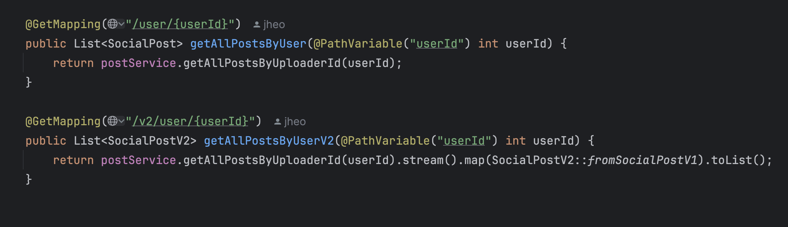

# Microservice Hands-On
- [Post-server](https://github.com/KyleKim107/post-server)
    - The Post-Server is responsible for managing social media posts in a microservice-based SNS system. It provides a REST API that allows users to create, retrieve, and delete posts.
        - API supports backward compatibility through versioning with an alternative endpoint:
            * `(GET /api/posts/user/{userId})`
        - Returns a list of SocialPostV2 objects.(Updated APIs)
            * `(GET /api/posts/v2/user/{userId})`

- [Image-server](https://github.com/KyleKim107/image-server)
    - The Image-Server is responsible for handling image uploads and retrievals in the SNS system. It provides a REST API for users to upload and view images.
        - Upload an Image
            - POST /api/images/upload
            - Accepts an image file (MultipartFile), stores it, and returns an image ID.
        - Retrieve an Image
            - GET /api/images/view/{imageId}

- [Timeline-server](https://www.google.com)
    The **Timeline-Server** manages user feeds in the SNS system, providing APIs to retrieve posts, manage likes, and generate personalized timelines.
        ### 1. **Retrieve All Feeds**
        - **GET** `/api/timeline`
        - Returns a list of all posts in the system.

    ### 2. **Retrieve a User's Feed**
        - **GET** `/api/timeline/{userId}`
        - Returns posts specific to a user.
- [User-server](https://github.com/KyleKim107/user-server)
- [Middleware](https://github.com/KyleKim107/middleware)
    - Provides a simple setup for middleware infrastructure using Docker. It includes configurations for:

        - MySQL: A relational database with a pre-configured schema (ddl.sql) and root password setup.
Kafka: A message queue system for distributed streaming, running on port 9092.
Redis: An in-memory data store for caching or fast data access, running on port 6379.
- [sns-frontend](https://github.com/KyleKim107/sns-frontend)
    - This repository provides the frontend UI for a microservice-based SNS (Social Networking Service) similar to Instagram or Facebook. Users can log in, upload photos, and view their feed.
        - Features

            - User Authentication: Log in functionality for users.

            - Photo Upload: Users can upload photos to their profile.

            - Feed Display: Users can view all the photos they have posted.

## API Versioning and Backward Compatibility
- An API specification is like an agreement between services, which often leads developers to assume that it will remain consistent when interacting with other services.

- However, API request and response specifications are bound to change over time. Due to the nature of microservices, where services are often split based on the organization’s structure, it can be difficult to quickly notify all affected services of these changes. This lack of coordination often results in system failures.

- The most common approach to managing changes in API specifications is for all affected services to update at the same time to stay in sync.

